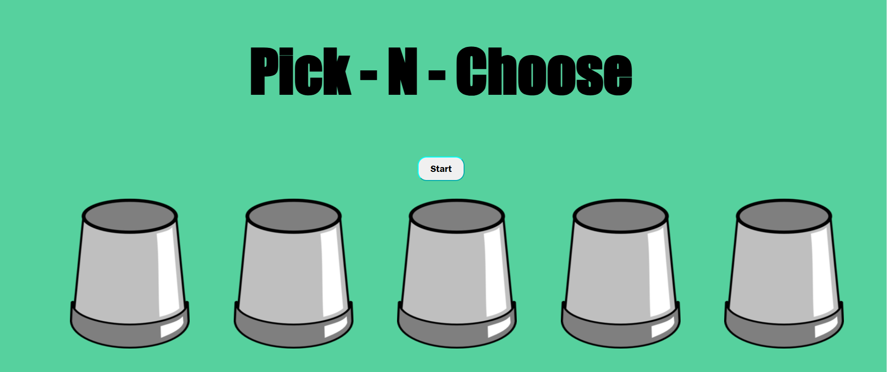

# Pick - N - Choose

<!-- # = h1
## = h2
### = h3
...
--> 

## About
The Name of the game is Pick-N-Choose

This game was an idea I came up with on the fly conceptually, and as a means to stand out from the typical crowd of the given examples that projects would typically provide as grounds work.

### How to Play:

In this game, you must find a certain number of balls randomly underneath 5 cups within 3 given rounds. Each time you find you find all the given balls in the cups, you get to progress to the next round, up until the final round. Find the final ball in the last, and you'll be deemed the winner of the game. But BEWARE, if at any point you choose an incorrect cup,the game is over, and will have to start ALL OVER again.

## Getting Started

All you have to do is click on the start button to intiate the game, that will randomly generate the balls in the first round. from there, all the player has to do is click on the displayed cups to interact with the game, and find the balls. Once the player wins or loses at the game, they will have the option to click on the restart button to reset and replay the game.

## Attributions

I was provided a little support from my instructors, Joshua Smith and Megan Hawkins on the subject to setup for the ramdom ball generation in the game.

I used ChatGBT to use as an understanding as a means to setup the way of progressing the rounds each time you meet the win conditions

## Technologies used

1. Javascript
    a. setTimeout
    b. DOM
1. HTML
1. CSS
1. [Tailwind CSS (Stretch)] (https://tailwindcss.com/)

## Next Steps

-Explore CSS Library
-Timers for UI changes
-Animated Background GIFs